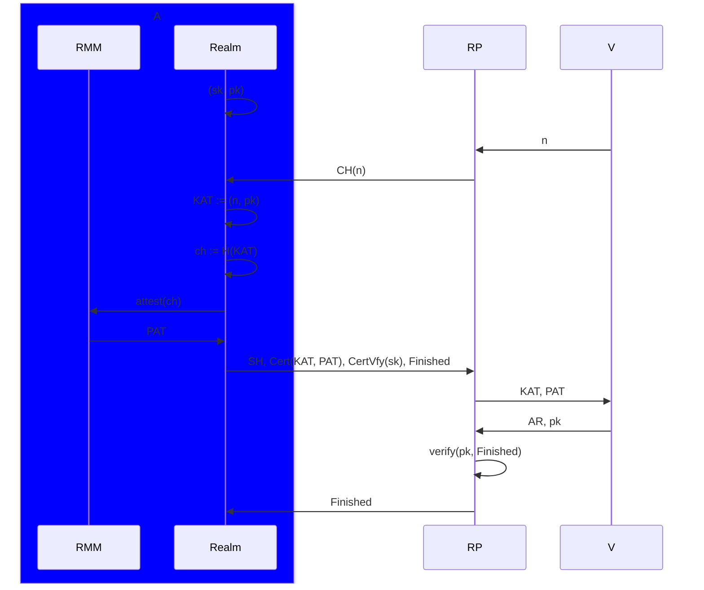

```mermaid
sequenceDiagram
    box blue A
    participant RMM
    participant Realm
    end
    participant RP
    participant V
    Realm->>Realm: (sk, pk)
    V->>RP: n
    RP->>Realm: CH(n)
    Realm->>Realm: KAT := (n, pk)
    Realm->>Realm: ch := H(KAT)
    Realm->>RMM: attest(ch)
    RMM->>Realm: PAT
    Realm->>RP: SH, Cert(KAT, PAT), CertVfy(sk), Finished
    RP->>V: KAT, PAT
    V->>RP: AR, pk
    RP->>RP: verify(pk, Finished)
    RP->>Realm: Finished
```
